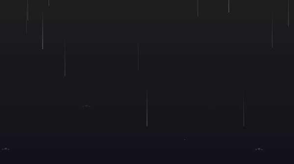

# Animation-Background-using-css-and-javascript
<h1> Table of Content </h1>
<ul>
  <l1> Rain Effect-1 </li>
   
   <l1> Rain Effect-2 </li>
     
   <l1> Interactive Background</li>
     
   <l1> Color Change on Mouse Click </li>
     
   <l1> Wave Effect </li>
     
   <l1> LandScape Animation</li>
     
   <l1> Floating Cloud Animation </li>
     
   <l1> Parallax Star background in CSS</li>
     
  <l1> Pure CSS3 Gradient Background</li>
     
  <l1> Canvas Parallax Skyline</li>
     
   <l1>Jquery & CSS3 </li>
     
   <l1> Color Change on Scroll</li>
     
   <l1> Ambient</li>
     
  <l1> three.js (Particles)</li>
     
   <l1>Shooting Stars</li>
     
  <l1>Crystal Canvas</li>
     
   <l1>RainBow</li>
     
   <l1>SVG Animations</li>
     
</ul>

<h2> Website is published at: https://inceptionabhishek.github.io/Animation-Background-using-css-and-javascript/  </h2>
<table>
  <tr>
    <h3> Rain Effect-1 </h3>
  </tr>
  <tr>
   </img>
  </tr>
  <tr>
    <h3> Rain Effect-2 </h3>
  </tr>
  <tr>
   </img>
  </tr>
   <tr>
    <h3> Interactive Background </h3>
  </tr>
  <tr>
   </img>
  </tr>
   <tr>
    <h3>Color Change on Mouse Click </h3>
  </tr>
  <tr>
   </img>
  </tr>
   <tr>
    <h3>Wave Effect </h3>
  </tr>
  <tr>
   </img>
  </tr>
   <tr>
    <h3> LandScape Animation</h3>
  </tr>
  <tr>
   </img>
  </tr>
   <tr>
    <h3>Floating Cloud Animation </h3>
  </tr>
  <tr>
   </img>
  </tr>
   <tr>
    <h3>Parallax Star background in CSS </h3>
  </tr>
  <tr>
   </img>
  </tr>
   <tr>
    <h3> Pure CSS3 Gradient Background </h3>
  </tr>
  <tr>
   </img>
  </tr>
   <tr>
    <h3> Canvas Parallax Skyline </h3>
  </tr>
  <tr>
   </img>
  </tr>
   <tr>
    <h3> Jquery & CSS3  </h3>
  </tr>
  <tr>
   </img>
  </tr>
   <tr>
    <h3> Color Change on Scroll </h3>
  </tr>
  <tr>
   </img>
  </tr>
   <tr>
    <h3> Ambient </h3>
  </tr>
  <tr>
   </img>
  </tr>
   <tr>
    <h3> three.js (Particles) </h3>
  </tr>
  <tr>
   </img>
  </tr>
    <tr>
    <h3> Shooting Stars </h3>
  </tr>
  <tr>
   </img>
  </tr>
    <tr>
    <h3> Crystal Canvas</h3>
  </tr>
  <tr>
   </img>
  </tr>
    <tr>
    <h3> RainBow</h3>
  </tr>
  <tr>
   </img>
  </tr>
    <tr>
    <h3> SVG Animations </h3>
  </tr>
  <tr>
   </img>
  </tr>
  
  
<table>
  
